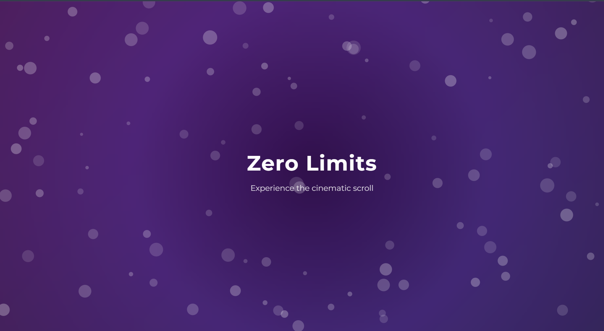

# Cinematic Scroll UI

A scroll-driven, cinematic web experience built in React.  
Inspired by the Zero Limits immersive UI.

## Live Demo
https://cinematic-scroll-uivercel.vercel.app/

## Features
- Continuous atmospheric particle background
- Smooth parallax transitions between sections
- Scroll-based text motion and fading
- High-performance animation with Framer Motion

## Tech Stack
| Feature | Library |
|--------|---------|
| Scroll Animations | Framer Motion (`useScroll`) |
| Particle System | react-tsparticles |
| Build Tool | Vite |
| Framework | React |

## Screenshots
*(Add your captures here, like:)*
/screenshots/hero.png
/screenshots/hero.png
/screenshots/hero.png

### Run HTTP

